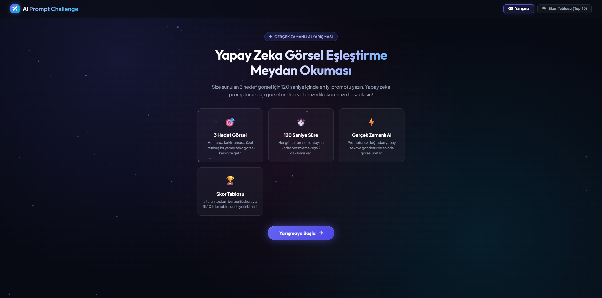
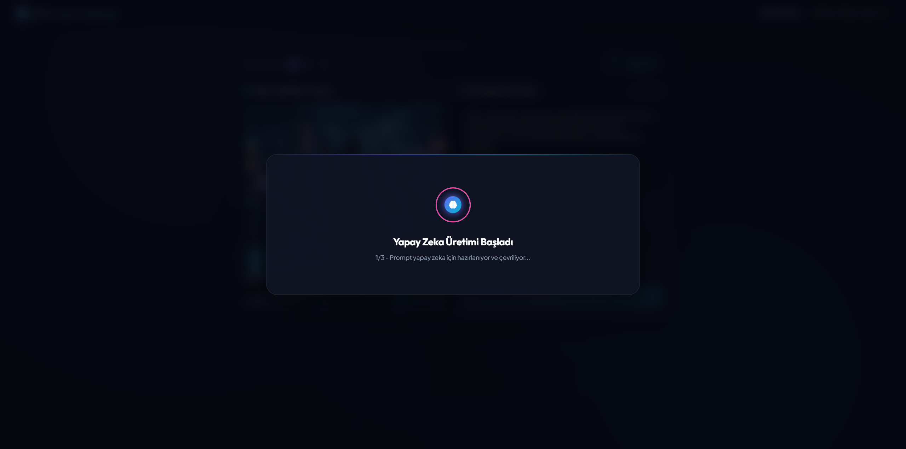
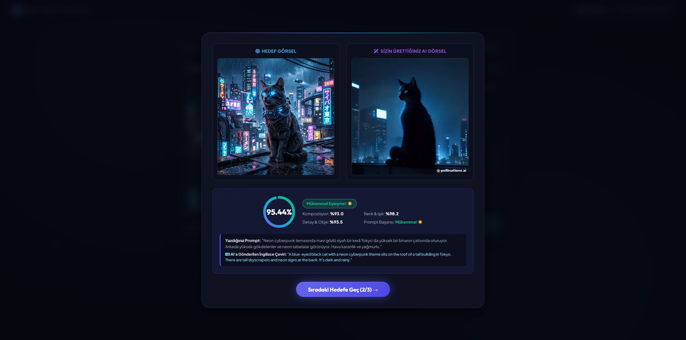
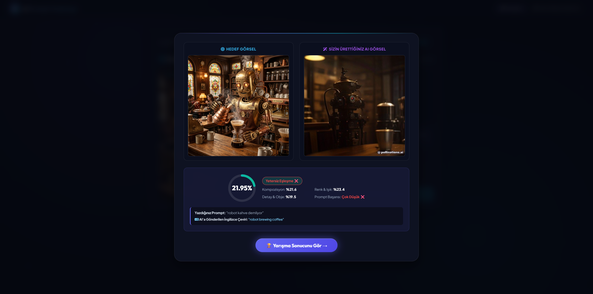
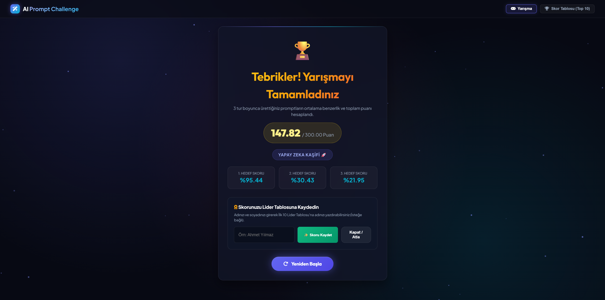
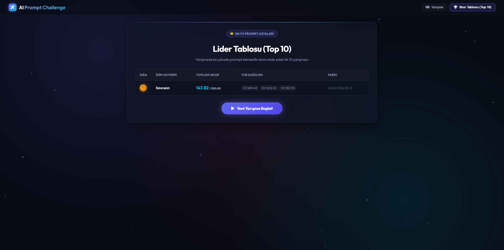
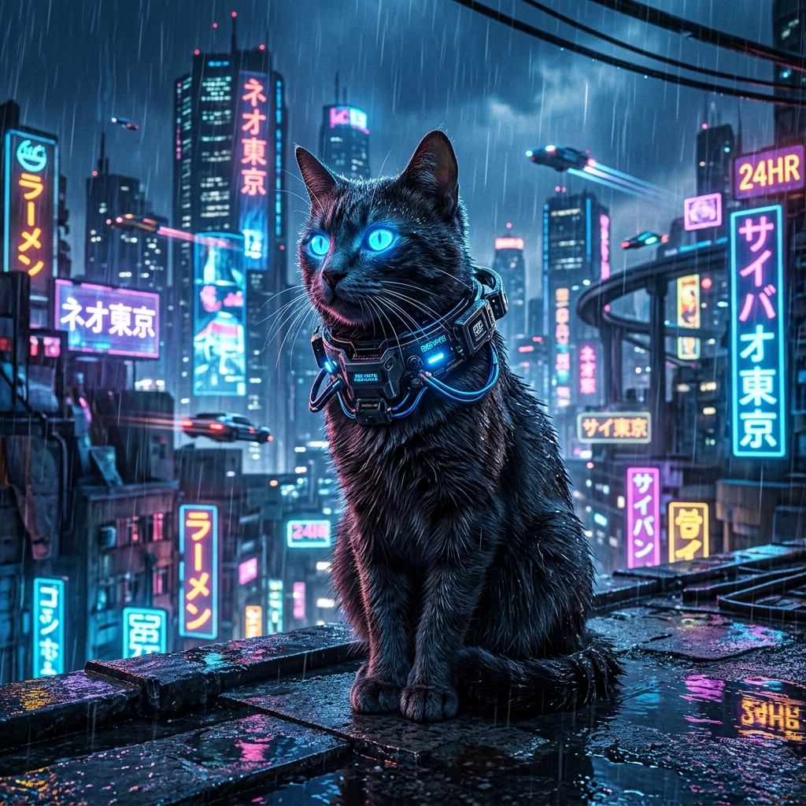
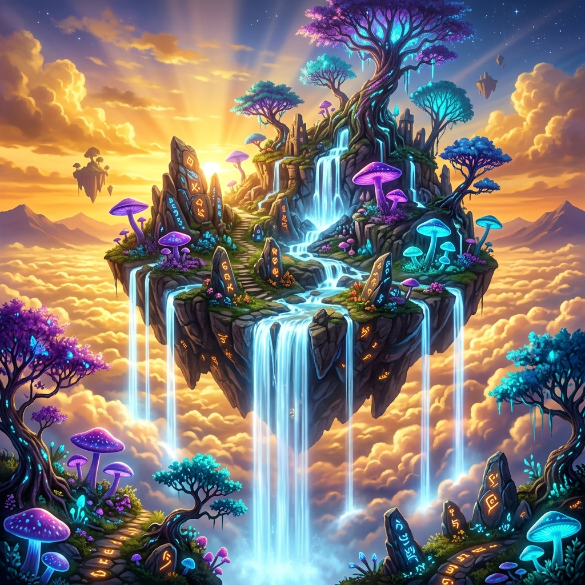
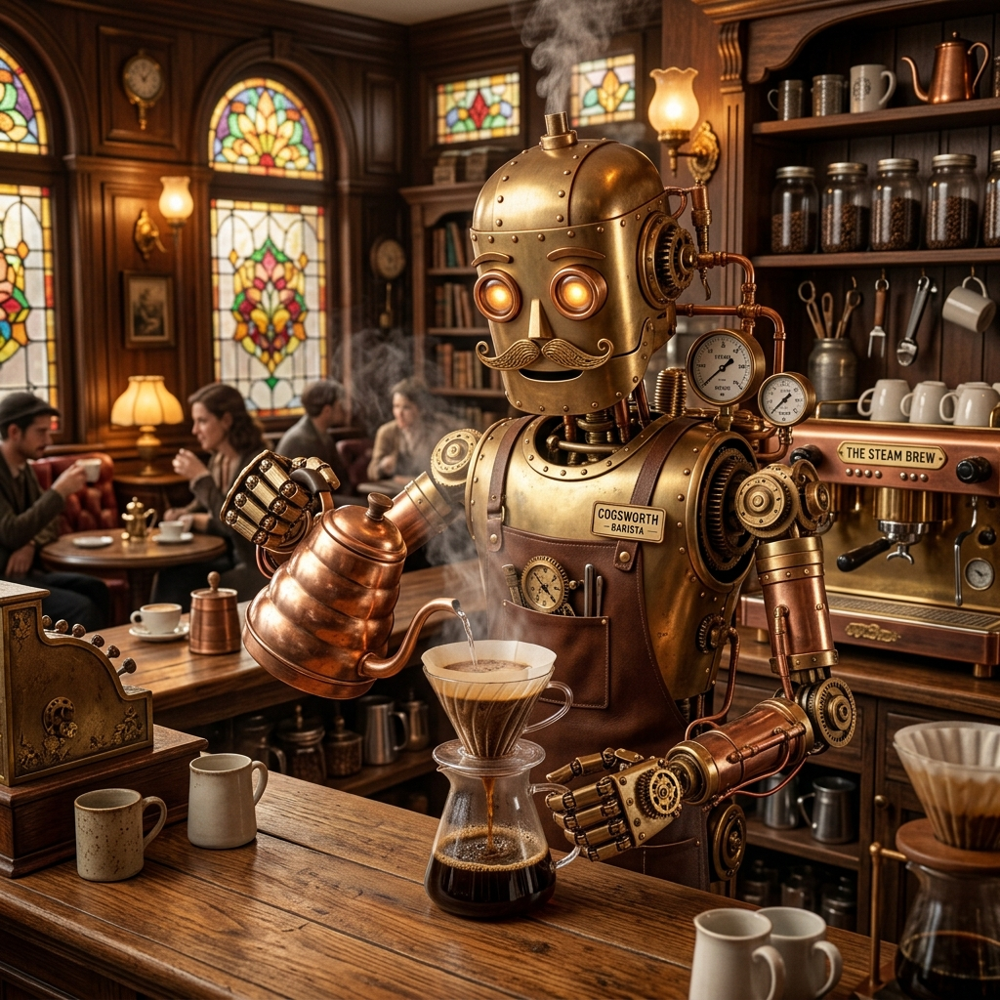
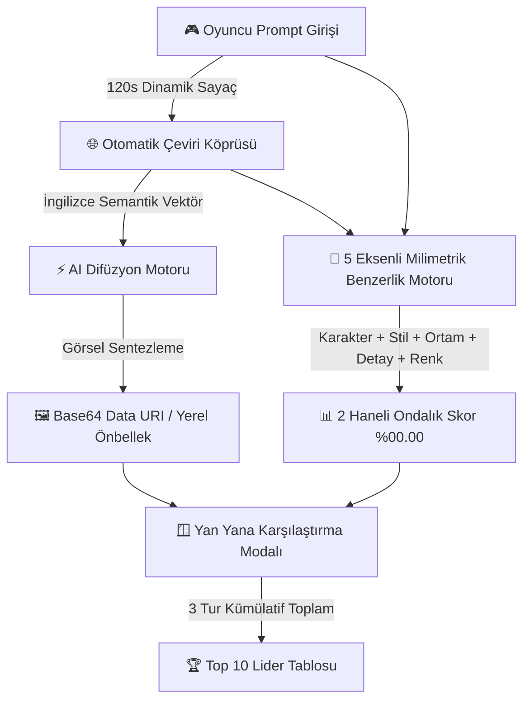

# 🎨 AI Prompt Challenge — Portfolio Case Study & Showcase

  <b>Yapay Zeka Görsel Eşleştirme, Prompt Mühendisliği ve Rekabetçi Oyunlaştırma Deneyimi</b>

---

## 📌 Proje Özeti (Executive Summary)

**AI Prompt Challenge**, kullanıcıların yaratıcı prompt yazma becerilerini gerçek zamanlı yapay zeka modelleriyle test eden etkileşimli bir web platformudur. 

Yarışmacılar, sunulan yüksek çözünürlüklü hedef görselleri inceleyerek **120 saniye** içinde en isabetli betimlemeyi yazar. Sistem, promptu anlık olarak difüzyon modellerine iletir, gerçek zamanlı görsel üretir ve hedef görsel ile üretilen görsel arasındaki anlamsal, kompozisyonel ve renk uyumunu **%00.00 hassasiyetinde** puanlayarak lider tablosunda listeler.

---

## 📸 Arayüz & Oyun Deneyimi Vitrini (UI Walkthrough)

### 1. Karşılama & Kurallar Ekranı
Yarışma mekaniklerini, 120 saniyelik zaman sınırını ve yapay zeka puanlama sistemini tanıtan modern açılış ekranı.

---

### 2. Canlı Yarışma & 120s SVG Geri Sayım Sayacı
Kullanıcının hedef görseli incelediği, kelime ve karakter sınırlarını takip ettiği ve anlık SVG dairesel geri sayım sayacıyla yarıştığı ana oyun arayüzü.

---

### 3. Gerçek Zamanlı AI Görsel Üretimi & Yan Yana Karşılaştırma Modalı
Yazılan promptun yapay zekaya aktarılmasıyla üretilen özgün görselin, hedef görsel ile yan yana getirildiği ve **Kompozisyon**, **Renk & Işık**, **Detay & Obje** uyumunun milimetrik hesaplandığı sonuç ekranı.

---

### 4. İleri Düzey Tematik Turlar (Steampunk & Cyberpunk)
Farklı sanatsal akımlara (Cyberpunk, Büyülü Fantastik Ada, Steampunk Barista) sahip çoklu tur yapısı.

---

### 5. Yarışma Sonu Başarı & Kümülatif Skor Ekranı
3 turun toplam benzerlik puanının (`300.00` üzerinden) hesaplandığı, yapay zeka unvanının verildiği ve lider tablosuna isim kaydının yapıldığı final ekranı.

---

### 6. Top 10 Lider Tablosu (Leaderboard)
En yüksek benzerlik oranına ulaşan yarışmacıların altın 🥇, gümüş 🥈 ve bronz 🥉 rozetlerle sıralandığı, tur bazlı puan dağılımlarını içeren dinamik sıralama tablosu.

---

## 🎯 Hedef Görsel Galerisi (Target Showcase)

<table>
  <tr>
    <td align="center"><b>Hedef 1: Siber Kedi (Neo-Tokyo)</b></td>
    <td align="center"><b>Hedef 2: Büyülü Uçan Ada</b></td>
    <td align="center"><b>Hedef 3: Steampunk Robot Barista</b></td>
  </tr>
  <tr>
    <td></td>
    <td></td>
    <td></td>
  </tr>
</table>

---

## 🏗️ Sistem Mimarisi & Çalışma Mantığı

---

## 💡 Öne Çıkan Mühendislik Çözümleri

1. **Bilişsel Çeviri Köprüsü (Multilingual Prompt Bridge):**  
   Difüzyon modelleri ağırlıklı olarak İngilizce eğitildiği için, Türkçe girilen doğal ifadeleri arka planda anlık olarak İngilizce semantik vektörlere dönüştürerek yanlış üretimleri (hallucination) engeller.
2. **Milimetrik Skorlama Algoritması (%00.00 Hassasiyet):**  
   Basit kelime eşleştirmesi yerine; Ana Karakter (%30), Sanatsal Stil (%25), Ortam (%20), Detay & Aksesuar (%15) ve Renk Paletini (%10) ağırlıklandıran deterministik 2 basamaklı ondalık puanlama motoru.
3. **Sıfır Gecikmeli Base64 İletimi:**  
   Üretilen görseller istemciye doğrudan Base64 Data URI olarak aktarılır; harici ağ kesintilerinde veya CORS kısıtlamalarında dahi kırık görsel ihtimali tamamen ortadan kaldırılmıştır.

---

## ⚙️ Teknoloji Yığını

- **Frontend:** Vanilla JavaScript (ES6+ SPA State Machine), HTML5 Semantic Architecture.
- **Styling & Estetik:** Vanilla CSS3 (Custom Properties, Glassmorphism, Responsive Grid, Neon Glow).
- **Backend / API:** PHP 8.2 (RESTful Endpoints, cURL Proxy, GD Graphics Processing).
- **Veri Depolama:** JSON File-based High Performance Storage (`scores.json`).
- **Yapay Zeka:** Pollinations Diffusion Engine & Real-time Translation API.

---

  Geliştirici: <b>Sevcan Koç</b> • Yıl: <b>2026</b>

